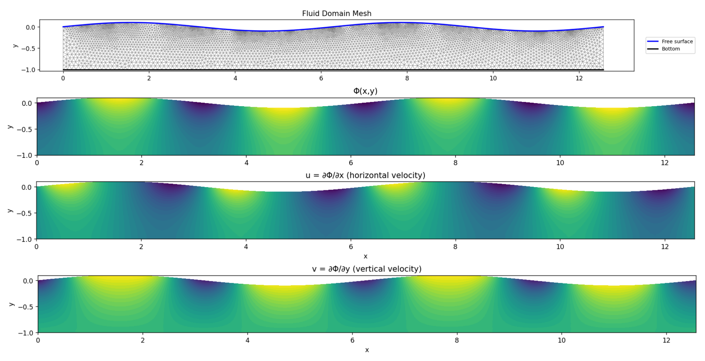

# FlowReconstruct: Potential Flow Reconstruction from Dirichlet data with periodic boundary conditions

**Author:** Dr. Denys Dutykh (Khalifa University of Science and Technology, Abu Dhabi, UAE)

**Date:** 2025-05-13

## Overview
This project provides a workflow for reconstructing the velocity potential in a 2D wave tank given random sea state data, using mesh generation and finite element methods (FEniCS/Gmsh).

<p align="center">
  
</p>

## Components & Workflow

**New in the latest version:**
- After solving the Laplace equation, the script automatically plots the potential Φ(x, y) and both velocity components (u, v) as scalar fields over the domain.
- The script now extracts, plots, and saves the horizontal and vertical velocity components along the free surface to CSV files: `solution/u_free_surface.csv` and `solution/v_free_surface.csv`.

1. **generate_data.py**
   - Generates random samples of x in [0, L], computes surface elevation η(x) and velocity potential φ(x), and saves results to a CSV file.
   - Usage example:
     ```bash
     python generate_data.py [-a AMPLITUDE] [-L LENGTH] [-N NUM_SAMPLES] [-o OUTPUT_DIR] [--seed SEED]
     ```

2. **mesh_domain.py**
   - Reads wave data from CSV, extrapolates endpoints, generates a triangular mesh of the fluid domain (for FEniCS), and exports to Gmsh (.msh) and XDMF files. Also plots the domain and mesh.
   - Usage example:
     ```bash
     python mesh_domain.py -i data/data.csv -m mesh/mesh.msh -x mesh/mesh.xdmf --mesh-size 0.1
     ```

3. **solve_laplace.py**
   - Solves the Laplace equation ∇²Φ = 0 in the generated mesh domain, with appropriate boundary conditions (periodic, Neumann, Dirichlet from data).
   - Plots the potential field Φ(x, y) and visualizes both horizontal (u = ∂Φ/∂x) and vertical (v = ∂Φ/∂y) velocity components after solving.
   - Extracts the free-surface velocity components (u, v) at the surface points and saves them to `solution/u_free_surface.csv` and `solution/v_free_surface.csv`.
   - Exports the solution to XDMF format.
   - Usage example:
     ```bash
     python solve_laplace.py --mesh mesh/mesh.xdmf --data data/data.csv --degree 2 --output solution/solution.xdmf
     ```

## Requirements
- Python 3.x
- numpy, matplotlib, scipy, gmsh, meshio, fenics

## Output Directory Structure
- Mesh files are saved in the `mesh/` subdirectory by default.
- Solution files are saved in the `solution/` subdirectory by default.
- Free-surface velocity CSV files are saved as `solution/u_free_surface.csv` and `solution/v_free_surface.csv`.

## Usage
1. Generate data: `generate_data.py`
2. Generate mesh: `mesh_domain.py`
3. Solve Laplace: `solve_laplace.py`

See each script's docstring for details and options.

---
